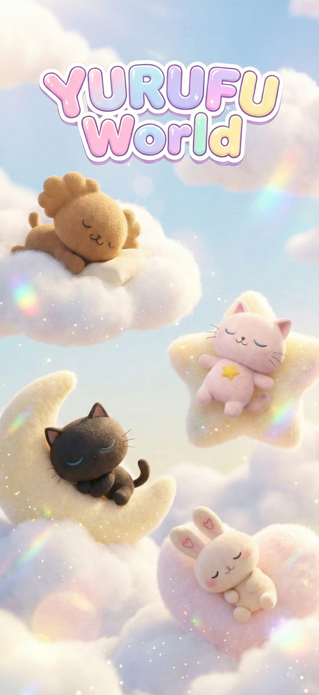

# YURUFUWorld（開発中）

Unity 6 と AIを組み合わせた、癒やし系のペット育成アプリケーションです。
最新のエンジン環境で、C#を用いたゲームロジックとAIによる動的なコミュニケーションの融合に挑戦しています。

## 🌟 プロジェクトの概要
「忙しい日常に、自分だけの癒やしのパートナーを」というコンセプトで開発しています。
ユーザーの言葉をAIが理解し、ペットが個性豊かに反応する「次世代の育成体験」を提供することを目指しています。
デザイン面では、ユーザーがリラックスできるよう「ゆるふわ」な世界観を大切にしています。

## 🛠 使用技術（テックスタック）
* **ゲームエンジン:** Unity 6.3 LTS (6000.3.9f1) 
* **言語:** C#
* **AI連携:** OpenAI API (ChatGPT) 連携予定
* **インフラ:** AWS (構築予定)
* **開発ツール:** Visual Studio, Git / GitHub

## 🚀 現在の実装状況と今後の予定
現在は、ユーザー体験の根幹となるUIを中心に開発を進めています。

### 実装済み
* **UIデザイン・実装:** 「ゆるふわ」な世界観を表現するUIのプロトタイプ制作。
* **基本システム:** Unity上での画面遷移や基本的な操作ロジックの実装。

### 今後の開発ロードマップ
1. **キャラクターの3Dモデリング:** オリジナルキャラクターを3Dで制作し、Unity上でのアニメーションを実装。
2. **AI対話基盤の構築:** OpenAI APIと連携し、ペットとリアルタイムで会話できる機能を統合。
3. **インフラ構築 (AWS):** セキュアで拡張性の高いデータ管理のため、バックエンドインフラをAWSで構築。

## 💡 こだわりと挑戦
* **最新環境での開発:** Unity 6の最新機能を活用し、より表現力豊かなゲーム体験を追求しています。
* **技術の掛け合わせ:** 単なるゲーム制作に留まらず、AIやAWSインフラを組み合わせた「次世代のプロダクト」としての完成度を目指しています。

---
「技術で新しいエンタメ体験を作る」Unityエンジニアを目指し、日々開発を継続しています！
